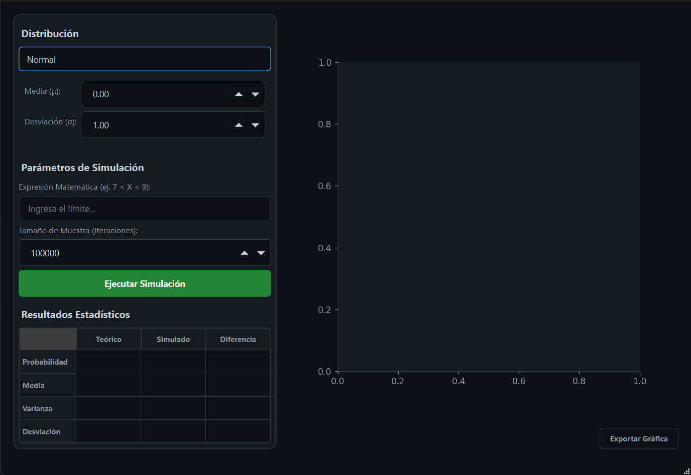

Markdown
# 📊 Simulador Estocástico de Probabilidades


Una herramienta computacional interactiva desarrollada en Python orientada al análisis, simulación y visualización de modelos probabilísticos. Este proyecto permite contrastar las matemáticas teóricas de las funciones de densidad y masa de probabilidad con resultados empíricos generados a través de simulaciones de Monte Carlo.

Desarrollado para la unidad de aprendizaje de **Probabilidad y Estadística** de la Escuela Superior de Cómputo (ESCOM - IPN).

---

## 🚀 Características Principales

* **8 Modelos Matemáticos:** Soporte nativo para 3 distribuciones continuas y 5 distribuciones discretas.
* **Simulación de Fuerza Bruta:** Generación masiva de muestras pseudoaleatorias procesadas en milisegundos mediante computación vectorizada (`NumPy`).
* **Análisis Comparativo en Tiempo Real:** Tabla estadística integrada que contrasta Probabilidad, Media, Varianza y Desviación Estándar empírica vs teórica.
* **Autómata de Procesamiento Sintáctico:** Motor de *parsing* basado en expresiones regulares para interpretar y evaluar expresiones matemáticas lógicas (ej. `45 < X < 55`).
* **Blindaje de Integración al Infinito:** Algoritmo dinámico implementado sobre `scipy.integrate` para evitar desbordamientos analíticos (*underflow*) en colas asintóticas.
* **Renderizado Dual:** Gráficos vectoriales que superponen el comportamiento de la simulación empírica (histogramas/barras) con la curva matemática perfecta del modelo.

---

## 📸 Interfaz Gráfica


> 

---

## 💻 Guía de Instalación y Despliegue

### 1. Clonar el repositorio
Abre una terminal y ejecuta los siguientes comandos para descargar el proyecto:
```bash
git clone [https://github.com/cipher-gx/Simulador-de-distribuciones-de-probabilidad.git](https://github.com/cipher-gx/Simulador-de-distribuciones-de-probabilidad.git)
cd Simulador-de-distribuciones-de-probabilidad

2. Instalar el archivo de dependencias
Este proyecto requiere librerías externas para funcionar (PyQt6, NumPy, SciPy y Matplotlib). El archivo requirements.txt ya incluye la lista completa. Ejecuta este comando en la carpeta raíz del proyecto para descargar e instalar todo automáticamente:

Bash
pip install -r requirements.txt

3. Inicializar el Sistema
Una vez que el proceso anterior finalice correctamente, lanza la aplicación con:

Bash
python main.py
📋 Instrucciones de Uso
Selección: Abre el menú desplegable en la esquina superior izquierda y elige el modelo probabilístico deseado (ej. Normal, Binomial, Poisson).

Parámetros: Ingresa los valores numéricos en las cajas de texto correspondientes. El sistema incluye validaciones para impedir errores físicos (ej. probabilidades fuera de rango).

Expresión Matemática: Escribe el rango que deseas analizar usando sintaxis lógica, por ejemplo: X < 55, X >= 3 o 15 < X < 25.

Tamaño de Muestra: Define cuántos datos aleatorios va a generar la computadora. Se recomienda encarecidamente usar 100,000 iteraciones para observar la convergencia real hacia la curva teórica.

Simulación: Presiona el botón verde "Ejecutar Simulación". El programa procesará el motor estocástico, actualizará la tabla comparativa y renderizará la gráfica.

Evidencia: Utiliza el botón "Exportar Gráfica" (esquina inferior derecha) para guardar tu análisis en archivos PDF, PNG o SVG

⚙️ Arquitectura del Proyecto
Plaintext
📁 Simulador-Estocastico/
├── 📄 main.py                      # Controlador principal y GUI
├── 📄 interfaz.ui                  # Diseño visual (Qt Designer)
├── 📄 requirements.txt             # Librerías necesarias
├── 📁 distribucionesContinuas/     # Lógica matemática (Continuas)
└── 📁 distribucionesDiscretas/     # Lógica matemática (Discretas)


👨‍💻 Autor
Cristian Gael Rodríguez Andrade Escuela Superior de Cómputo (ESCOM) - Instituto Politécnico Nacional